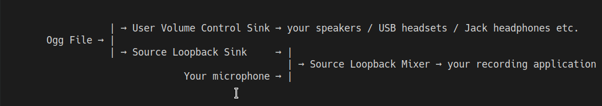

# Fake Microphone Wav Player C Binding Library
 > See [FakeMicWavPlayer](https://github.com/SCOTT-HAMILTON/FakeMicWavPlayer)


CFakeMicWavPlayer is a C binding for the FakeMicWavPlayer library.
Fake is a pulseaudio client that can inject ogg files like a microphone to any recording app on linux.

# Meson Building 
To build it, run : 
```sh
meson setup build
ninja -C build
ninja -C install
```

# How does it work
 Fake creates a pipeline structure of virtual sink, virtual combined sinks and loopback module to perform
 its magical work. This structure allows separate volume control of the played audio file both to
 the recording app and to your personnal headphones/headsets/... It also allows you to be kept recorded
 while the audio is playing; you can still talk to your friends while streaming them music ! This structure
 is however not cpu costless and all those intermediates streaming devices could decrease your processing 
 performances a bit. Although this structure is not CPU-costless, most of the experienced performance drop
 originates from the recording app.

 - If the structure of the software interests you, here is a summarized view of it :


# Example Usage
```c
#include <CFakeMicWavPlayerLib.h>

int stream_ogg_file_to_audacity() {
	if (fkmp_initwithaudiofile("Music.ogg",
			"alsa_output.usb-Sennheiser_Sennheiser_SC60_for_Lync_55ef416267-00.analog-stereo.monitor", 
			"alsa_output.pci-0000_00_1f.3.analog-stereo",
			"audacity") != 0)
		return 1;
	if (fkmp_set_source_volume(90.0) != 0)
		return 1;

	if (fkmp_set_user_volume(40.0) != 0)
		return 1;
	while (fkmp_playnonblocking() == 0);
	fkmp_cleanplayer();
	fkmp_clean();
}

int stream_music_app_to_audacity() {
	if (fkmp_initwithsinkinput("spotify", 
			"alsa_output.usb-Sennheiser_Sennheiser_SC60_for_Lync_55ef416267-00.analog-stereo.monitor", 
			"alsa_output.pci-0000_00_1f.3.analog-stereo",
			"audacity") != 0)
		return 1;
	if (fkmp_set_source_volume(90.0) != 0)
		return 1;

	if (fkmp_set_user_volume(40.0) != 0)
		return 1;
	// wait until you want to end the stream by cleaning
	fkmp_clean();
}
	
int main(int argc, char *argv[]) {
	if ( /* some tests*/) {
		stream_ogg_file_to_audacity();
	} else {
		stream_music_app_to_audacity();
	}
	return 0;
}
```

### Requirements

Fake requires : 
 - [FakeMicWavPlayer](https://github.com/SCOTT-HAMILTON/FakeMicWavPlayer)


### Help

CFakeMicWavPlayer is just a little project, but feel free to fork, change, extend or correct the code.

# Warning

** Fake Mic Wav Player unloads all module-null-sink, module-combined-sink and module-combine-sink in existence as a cleanup precaution. This shouldn't bother most of the users except those who hack with pulseaudio.**

License
----
CFakeMicWavPlayer is delivered as it is under the well known MIT License


**References that helped**
 - [pulseaudio IRC] : <#pulseaudio>
 - [pulseaudio under the hood] : <https://gavv.github.io/articles/pulseaudio-under-the-hood/>
 - [pulseaudio documentation] : <https://freedesktop.org/software/pulseaudio/doxygen/>
 - [pulseaudio introspect API interface] :
   <https://freedesktop.org/software/pulseaudio/doxygen/introspect_8h.html>

[//]: # (These are reference links used in the body of this note and get stripped out when the markdown processor does its job. There is no need to format nicely because it shouldn't be seen. Thanks SO - http://stackoverflow.com/questions/4823468/store-comments-in-markdown-syntax)


   [pulseaudio IRC]: <#pulseaudio>
   [pulseaudio under the hood]: <https://gavv.github.io/articles/pulseaudio-under-the-hood/>
   [pulseaudio documentation]: <https://freedesktop.org/software/pulseaudio/doxygen/>
   [pulseaudio introspect API interface]:
   <https://freedesktop.org/software/pulseaudio/doxygen/introspect_8h.html>
